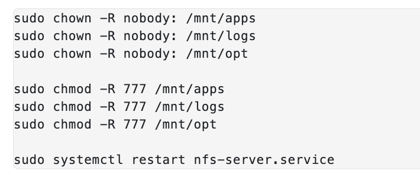

### DEVOPS TOOLING WEBSITE SOLUTION

In this project I will implement a solution that consists of following components:

1. Infrastructure: AWS
2. Webserver Linux: Red Hat Enterprise Linux 8
3. Database Server: Ubuntu 20.04 + MySQL
4. Storage Server: Red Hat Enterprise Linux 8 + NFS Server
5. Programming Language: PHP
6. Code Repository: GitHub

On the diagram below you can see a common pattern where several stateless Web Servers share a common database and also access the same files using Network File Sytem (NFS) as a shared file storage. Even though the NFS server might be located on a completely separate hardware – for Web Servers it look like a local file system from where they can serve the same files.

I will be creating:

- 3 EC2 instances for webservers using Redhat
- 1 EC2 instance for NFS Server using Redhat
- 1 EC2 instance for the DB Server using Linux

#### STEP 1 – PREPARE NFS SERVER

As this project builds on elements of what was previously done in Project 6, I will not be documenting the steps taken to create the 3 logical volumens on the NFS Server. I will only document from where the mount points were created

A few changes to note:

- The file system used is `xfs` in stead of `ext4`

The following mount points will be created:

Mount `lv-apps` on `/mnt/apps` – To be used by webservers
Mount `lv-logs` on `/mnt/logs` – To be used by webserver logs
Mount `lv-opt` on `/mnt/opt` – To be used by Jenkins server in Project 8

The folders created using the codes as follows:

`sudo mkdir -p /mnt/apps`

`sudo mkdir -p /mnt/logs`

`sudo mkdir -p /mnt/opt`

The code for mounting are as follows:

`sudo mount /dev/webdata-vg/lv-apps /mnt/apps`

`sudo mount /dev/webdata-vg/lv-logs /mnt/logs`

`sudo mount /dev/webdata-vg/lv-opt /mnt/opt`

Upon creating the mount points, running `df -h` shows the mount points created below:

The next step is to install the NFS server using the code below, configure it to start on reboot and make sure it is u and running:

`sudo yum -y update`

`sudo yum install nfs-utils -y`

`sudo systemctl start nfs-server.service`

`sudo systemctl enable nfs-server.service`

`sudo systemctl status nfs-server.service`

The snapshot below shows that the nfs server is active after running the code above:

The next step is to export the mounts for the webservers' subnet cidr to connect as clients. You will install your all three Web Servers inside the same subnet, but in production set up you would probably want to separate each tier inside its own subnet for higher level of security.

To check your subnet cidr – open your EC2 details in AWS web console and locate ‘Networking’ tab and open a Subnet link:

Make sure we set up permission that will allow our Web servers to read, write and execute files on NFS by running the codes below:

Configure access to NFS for clients within the same subnet (example of Subnet CIDR – 172.31.32.0/20 ) You will copy and paste the contents below into the text editor and replac the CIDR with the correct one for yoru EC2 instance:

Run the code: `sudo vi /etc/exports` and paste the following into the file and save

Run the code `sudo exportfs -arv` ensure that the webservers are able to see the file once we try to connect to it. 

Run the code below to see the port being used by NFS so that we can include this in our EC2 inbound rules:

`rpcinfo -p | grep nfs`

See below for the ports that were modified with 2049 and 111 for both custom UDP and custom TCP

#### STEP 2 — CONFIGURE THE DATABASE SERVER

- I started by connecting to Databse server using the following steps

First, I opened up port 3306 on my EC2 instance inbound rules for MYSQL/AURORA, I used the CIDR of the webserver in this case which is `172.31.16.0/20` 

1. To install the MySQL server, I ran the following commands in the order below:

- `sudo apt update -y`
- `sudo apt install mysql-server -y`
- `sudo systemctl enable mysql`
- `sudo mysql`

2. To create a database called `tooling`, i did the following:
- `CREATE DATABASE tooling;`

3. To create a database user and name it `webaccess` I did the following:

- `CREATE USER `webaccess`@`172.31.16.0/20` IDENTIFIED BY 'password';`

4. Grant permission to webaccess user on tooling database to do anything only from the webservers subnet cidr by do the following:
- `GRANT ALL PRIVILEGES ON tooling.* TO `webaccess`@`172.31.16.0/20`;`
- `FLUSH privileges;`

### Step 3 — Prepare the Web Servers

We need to make sure that our Web Servers can serve the same content from shared storage solutions, in our case – NFS Server and MySQL database.

You already know that one DB can be accessed for reads and writes by multiple clients. For storing shared files that our Web Servers will use – we will utilize NFS and mount previously created Logical Volume lv-apps to the folder where Apache stores files to be served to the users (/var/www).

This approach will make our Web Servers stateless, which means we will be able to add new ones or remove them whenever we need, and the integrity of the data (in the database and on NFS) will be preserved.

During the next steps we will do following:

- Configure NFS client (this step must be done on all three servers)
- Deploy a Tooling application to our Web Servers into a shared NFS folder
- Configure the Web Servers to work with a single MySQL database

1. Launch one webserver instance with redhat operating system
2. Install the NFS client using the following code:
`sudo yum install nfs-utils nfs4-acl-tools -y`

3. Mount `/var/www/` and target the NFS server’s export for apps using the following code:

`sudo mkdir /var/www`

`sudo mount -t nfs -o rw,nosuid <NFS-Server-Private-IP-Address>:/mnt/apps /var/www`

Ensure to use the NFS server private IP address in the second command above (`172.31.92.167` in this case hence the code used is shown below:)

`sudo mount -t nfs -o rw,nosuid 172.31.92.167:/mnt/apps /var/www`

Note that the `/mnt/apps` folder is located on the NFS server and the `/var/www` folder is located locally on the webserver

running `lsblk` command at this point shows below the mount from the NFS server to the webserver:

create a test file on `/var/www` using the code below on the webserver:

`sudo touch /var/www/test.md`

This file test file will now be visible in the `/mnt/apps` folder of the NFS server as seen below:

With this mount, anything that is created in the webserver /var/www folder will show up in the NFS server /mnt/apps folder

4. Verify that NFS was mounted successfully by running `df -h`. Make sure that the changes will persist on Web Server after reboot by doing the following:

`sudo vi /etc/fstab`

add the following line:

`<NFS-Server-Private-IP-Address>:/mnt/apps /var/www nfs defaults 0 0`

Ensure to use the NFS server private IP address in the code above. In this case, the code that was enterd in the fstab file is as follows:

172.31.92.167:/mnt/apps /var/www nfs defaults 0 0

(save and exit the fstab file after update)

5. Install Remi’s repository, Apache and PHP using the following code:

`sudo yum install httpd -y`

`sudo dnf install https://dl.fedoraproject.org/pub/epel/epel-release-latest-8.noarch.rpm`

`sudo dnf install dnf-utils http://rpms.remirepo.net/enterprise/remi-release-8.rpm`

`sudo dnf module reset php`

`sudo dnf module enable php:remi-7.4`

`sudo dnf install php php-opcache php-gd php-curl php-mysqlnd`

`sudo systemctl start php-fpm`

`sudo systemctl enable php-fpm`

`sudo setsebool -P httpd_execmem 1`

You are installing apachae as without it, a webserver is not a webserver.Apache is needed to serve content to the end users

After installing the Apache, you can check the /var/www folder on the webserver and here  you will find the cgi-bin and html files created after installing Apache

The same files can be found on the /mnt/apps folder of the NFS server. 

Now repeat steps 1-5 above for the other two webservers

6. Verify that Apache files and directories are available on the Web Server in `/var/www` and also on the NFS server in `/mnt/apps`. If you see the same files – it means NFS is mounted correctly. You can try to create a new file touch test.txt from one server and check if the same file is accessible from other Web Servers.

note that step 6 was already done above. 

7. Locate the log folder for Apache on the Web Server and mount it to NFS server’s export for logs. Repeat step 4 to make sure the mount point will persist after reboot.

Note that the logs folder for apache is located here `sudo ls /var/log/httpd` This folder should be empty at this point

To do the mount, run the code below which is similar to code from step 3 above: 

`sudo mount -t nfs -o rw,nosuid 172.31.92.167:/mnt/logs /var/log/httpd`

Note that the above is the private IP address of the NFS server

Now make sure that the changes will persist on Web Server after reboot by doing the following:

`sudo vi /etc/fstab`

add the following line:

`172.31.92.167:/mnt/logs /var/log/httpd nfs defaults 0 0`

Again, use the private address of the NFS  server in above

8. Fork the tooling source code from Darey.io Github Account to your Github account. (the ssh code is `git@github.com:darey-io/tooling.git`)

 - first install git by running the code:
  `sudo yum install git`
  `sudo git init`

- Then in the command line, enter the following code `sudo git clone https://github.com/darey-io/tooling.git`

Below snapshot shows the `tooling` folder which has been sucessfully cloned from the git hub repository

9. Deploy the tooling website’s code to the Webserver. Ensure that the html folder from the repository is deployed to /var/www/html

The above basically means to copy the contents of the `html` folder which has been cloned from the github repository to the folder named `/var/www/html` on the webserver

First cd into the tooling folder and run the code below:

`sudo cp -R html/. /var/www/html`

note that the command with `/.` means only content of the html folder will be copied and not the actual folder itself

Below snapshot shows the content of the `/var/www/html` folder after the copy operation

Ensure you open port 80 for HTTP on the inbound rules for the EC2 instance of the webserver. Enable for any IP address

Note to disable SELinux `sudo setenforce 0`
To make this change permanent – open following config file `sudo vi /etc/sysconfig/selinux` and set `SELINUX=disabled` then restrt httpd by using the code `sudo systemctl restart httpd`

Once you have done the above, you can then put the public ip address of your webserver into a web broswer and you will see the following: 

10. At this point you will not be able to connect to the database because you will need to update the website’s configuration to connect to the database (in `/var/www/html/functions.php` file). 

Do this by opening up the `functions.php` file with the code:

`sudo vi /var/www/html/functions.php`

modify the connect to database section of the file using the details fo the tooling database and webaccess user that we created. Note to use the private IP address of our DB which is `172.31.17.98`:

The changes made to the functions.php file is shown below:

ensure to check that you have installed mysql on the webserver using the code below:

`sudo yum update -y`

`sudo yum install mysql`

once this is done, CD into the tooling folder and then do the following:

Apply `tooling-db.sql` script to your database using this command `mysql -h <databse-private-ip> -u <db-username> -p <db-pasword> tooling < tooling-db.sql`

The actual code executed is as below:

`mysql -h 172.31.17.98 -u webaccess -p tooling < tooling-db.sql`

If you cannot connect with above code, check the following has been done:

- Ensure that in the inbound rules, you have added a Mysql/Aurora entry for the subnet of the NFS server which is `172.31.80.0/20`

- Change bind address on database server: 
Now go to the `DATABASE SERVER` and change the bind address..use the code below to open the file:

`sudo vi /etc/mysql/mysql.conf.d/mysqld.cnf`

Ensure to restart mysql once changes have been made to the bind address using the code below:

`sudo systemctl restart mysql`
`sudo systemctl status mysql`

Now go back to the webserver and apply `tooling-db.sql` script to your database using the code below (ensure you cd into the tooling folder before you do this):

`mysql -h 172.31.17.98 -u webaccess -p tooling < tooling-db.sql`

you will be prompted to enter a password so enter the password created for the webaccess user. Ensure the code is run the the tooling folder also

The below snapshot shows access has been granted:

11. Create in MySQL a new admin user with username: myuser and password: password:

INSERT INTO ‘users’ (‘id’, ‘username’, ‘password’, ’email’, ‘user_type’, ‘status’) VALUES
-> (1, ‘myuser’, ‘5f4dcc3b5aa765d61d8327deb882cf99’, ‘user@mail.com’, ‘admin’, ‘1’);

Before running the code above, you need to connect remotely from the webserver into the database server without using the ssh utility. Use the code below (ensure this code is run in the toolign folder that was recently connected to):

sudo mysql -u remote_user -h [ip-address-of-database] -p

The actual code that was run is shown below:

`sudo mysql -u webaccess -h 172.31.17.98 -p`

Snapshot below shows the sucessful connection to the database server:

You are now remotely connected to the database server using the webserver as client.

in the mysql kernel of the DATABASE SERVER, run:
`show databases;` to see the databases present

enter the code below:

`use tooling;`

`show tables;`

`select * from users;`

Running above code in the same sequence on the database server allows you to go into the tooling database, access the `users` table and display the users table in the tooling db. The shows us the admin username and password which can be used to access the php webpage. Here you will see the admin password to be used in accessing the php page. 

Below shows sucessfull connection to the php page:

### NOTE IF FOR ANY REASON YOU RESTART THE INSTANCES AND YOU ARE UNABLE TO RELOAD THE TOOLING WEBSITE ON THE WEB BROWSER, CHECK THE STATUS OF YOUR SERVICES ie PHP, HTTPD, etc... IN PARTICULAR, CHECK HTTPD SERVICE STATUS AND RESTART IT BEFORE LOADING WEBSITE AGAIN:

`sudo systemctl status httpd`
`sudo systemctl restart httpd`

